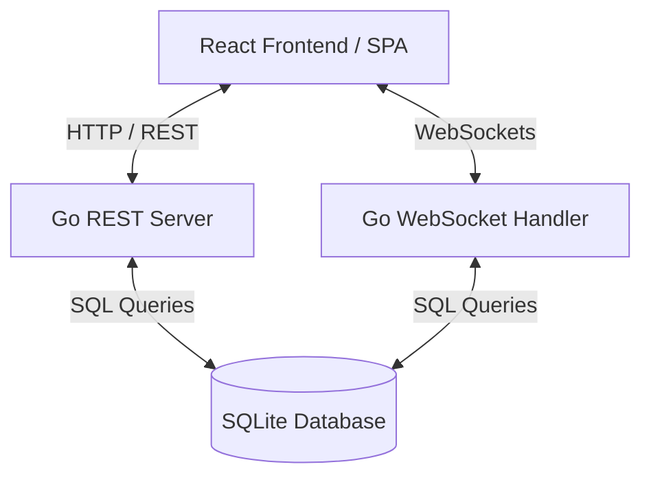

# Social Network

A Facebook-like social network application built with a **Go (Golang)** backend and a **React (Vite)** frontend. The application features user profiles (public/private), post creation with privacy settings, follower relationships, real-time private and group chats using WebSockets, group creation with event planning, and a global notification system.

---

## 🏗️ Architecture Overview

The system is designed with a decoupled client-server architecture:



*   **Frontend**: Built with **React 19**, **Vite** (for fast bundling/HMR), **React Router v7** (for routing), and **React Icons**.
*   **Backend**: Built with **Go 1.22.2**, utilizing the standard library `net/http`, `github.com/mattn/go-sqlite3` for database storage, `golang.org/x/crypto/bcrypt` for secure authentication, and `github.com/gofrs/uuid/v5` for UUID generation.
*   **Database**: **SQLite** with a custom lightweight migration runner.
*   **Real-time Communication**: WebSockets for instant message delivery.

---

## 📁 Repository Structure

```
.
├── backend/                  # Go Backend Application
│   ├── cmd/
│   │   └── server/
│   │       └── main.go       # Application Entrypoint
│   ├── internal/
│   │   ├── api/
│   │   │   ├── handlers/     # Request controllers (user, follower, etc.)
│   │   │   ├── middleware/   # CORS, Authentication session checks
│   │   │   └── routers/      # Router registration and dependency injection
│   │   ├── config/           # Environment variables configuration
│   │   ├── db/               # SQLite connection and migration application
│   │   │   └── migrations/   # Database migrations (UP/DOWN SQL scripts)
│   │   ├── models/           # Database structures and data transfer objects
│   │   ├── repositories/     # Data Access Layer (SQL queries)
│   │   └── services/         # Business logic layer
│   ├── pkg/
│   │   └── db/
│   │       └── migrations/   # Alternative path for external migrations
│   ├── Dockerfile            # Multi-stage production build configuration
│   └── go.mod                # Go module dependencies
│
├── frontend/                 # React Frontend Application
│   ├── public/               # Static assets
│   ├── src/
│   │   ├── assets/           # Frontend assets (images, SVGs)
│   │   ├── components/       # Reusable components (Header, Sidebar, Post)
│   │   ├── pages/            # Core views (Profile, Notifications, Groups, etc.)
│   │   ├── styles/           # CSS files and modules
│   │   ├── App.jsx           # Main routing and app structure
│   │   ├── index.css         # Tailwind/global style baseline
│   │   └── main.jsx          # React initialization entrypoint
│   ├── index.html
│   ├── package.json          # Node dependencies and scripts
│   └── vite.config.js        # Vite bundler configuration
│
└── docs/                     # Design and Specification Documents
    ├── openapi.json          # OpenAPI 3.0 API Specification
    ├── schema.dbml           # DBML Database schema design
    └── project-instructions.md
```

---

## 🗄️ Database Schema Design

The relational database is built using **SQLite**. The schema defined in [docs/schema.dbml](file:///home/qquinton/group/social-network/docs/schema.dbml) includes the following core entities:

*   **`users`**: Stores registration info, optional profile details (avatar, nickname, about me), public/private status, and follower counter caches.
*   **`sessions`**: Manages token-based session persistence mapping to cookies.
*   **`followers`**: Tracks relationships with states (`pending` or `accepted`).
*   **`posts`**: User and group posts with privacy validation rules (`public`, `almost_private`, `private`).
*   **`post_audiences`**: Defines specific users authorized to view target private posts.
*   **`comments`**: Threaded post replies (supporting parent-child comments).
*   **`groups`**: Group spaces created by users.
*   **`group_members`**: Group membership status (`pending_invite`, `pending_request`, `accepted`).
*   **`events`**: Event entities within a group.
*   **`event_rsvps`**: Users' responses to events (`going`, `not_going`, `pending_invite`).
*   **`dm_threads`**: Direct message rooms mapped between two users.
*   **`messages`**: Threaded messages (handling both private DMs and group chats).
*   **`notifications`**: Tracks events triggering alerts (follow requests, invitations, event creation, etc.).

---

## 🛠️ Developer Workflow & Setup

### Prerequisites
*   **Go**: Version `1.22+`
*   **Node.js**: Version `18+` (npm or yarn)
*   **Docker**: For containerized local development and deployment

---

### 1. Backend Local Setup

#### Environment Variables
Create a `.env` file in the `backend/` directory by copying `.env.example`:
```bash
cp backend/.env.example backend/.env
```
Ensure you configure the correct path to your sqlite database and migration directory:
```ini
PORT=8080
DATABASE_PATH=./db.sqlite
APP_ENV=development
ALLOWED_ORIGIN=http://localhost:5173
MIGRATIONS_DIR=./internal/db/migrations
```

#### Run Database Migrations
Migrations are applied automatically upon application startup. The migration engine scans the SQL files in `MIGRATIONS_DIR` and executes outstanding updates in alphabetical order. 

To add a new migration:
1. Create a migration file in `backend/internal/db/migrations/` (or `backend/pkg/db/migrations/sqlite/` depending on environment configuration):
   * `00000X_your_migration_name.up.sql` (Schema upgrade query)
   * `00000X_your_migration_name.down.sql` (Schema rollback query)
2. Run the application to auto-apply.

#### Start the server
From the `backend/` directory, run:
```bash
go run cmd/server/main.go
```
The backend server will start on port `8080` (or the customized port in `.env`).

---

### 2. Frontend Local Setup

#### Installation
From the `frontend/` directory, run:
```bash
npm install
```

#### Running Development Server
To launch Vite with Hot Module Replacement (HMR):
```bash
npm run dev
```
The client application will run at [http://localhost:5173](http://localhost:5173).

---

### 3. Docker Multi-Container Development

For full environment parity, run both services inside Docker containers:

#### Build Backend Image
From the `backend/` directory:
```bash
docker build -t social-network-backend .
```

#### Run Backend Container
```bash
docker run -p 8080:8080 \
  -e DATABASE_PATH=/app/db.sqlite \
  -e MIGRATIONS_DIR=/app/pkg/db/migrations/sqlite \
  -e ALLOWED_ORIGIN=* \
  social-network-backend
```

---

## 🔒 Core Flow Specifications

### 1. Authentication
*   Session storage is implemented using secure cookies (e.g., standard HTTP-only cookie validation).
*   Password security uses `bcrypt` hashing on registration.
*   Optional fields such as Avatar, Nickname, and About Me are handled during registration or updated in the profile section.

### 2. Profiles and Followers
*   Profiles can be public (default) or private.
*   **Public Profile Flow**: Follow requests are auto-accepted. Anyone can view activities, posts, and follower list.
*   **Private Profile Flow**: Follow requests generate a pending notification. User must accept the request before the follower can view profile content, posts, or activities.

### 3. Posts Privacy
*   **Public**: Displayed globally.
*   **Almost Private**: Displayed only to followers.
*   **Private**: Visible only to a targeted list of followers chosen by the creator (stored inside `post_audiences`).

### 4. Group Events & RSVPs
*   Group members can schedule events.
*   Events have RSVP choices: `Going` and `Not going`. RSVPs are tracked dynamically per member.

### 5. Websockets (Chat)
*   Websocket handshakes are authenticated.
*   Private DMs are delivered instantly when users are following each other.
*   Group chat rooms broadcast messages in real-time to active online members of that group.

---

## 📜 API Reference
The complete API routing and payload format specifications are defined in the OpenAPI 3.0 file:
📄 [docs/openapi.json](file:///home/qquinton/group/social-network/docs/openapi.json)

Key endpoints include:
*   `POST /api/users/register` - Create an account.
*   `POST /api/users/login` - Authenticate and create a session.
*   `POST /api/users/logout` - Destroy session.
*   `GET /api/users/me` - Fetch profile metadata of the current logged-in user.
*   `POST /api/followers/follow` - Initiate a follow request or auto-follow.
*   `POST /api/followers/unfollow` - Unfollow a user.
